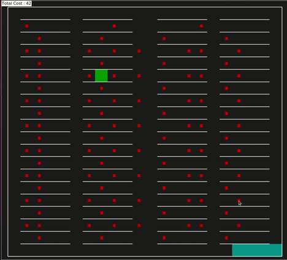
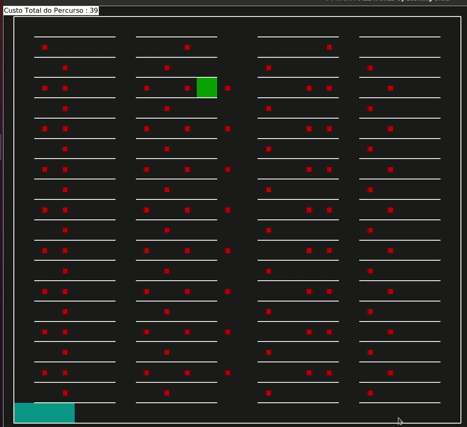
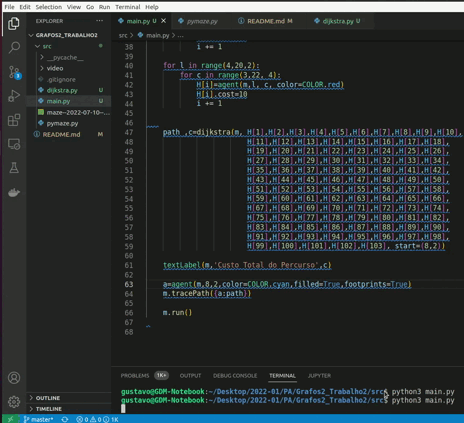

# Grafos2_ClassRoomMazeShortPath

**Número da Lista**: N/A<br>
**Conteúdo da Disciplina**: Grafos2<br>

## Alunos
|Matrícula | Aluno |
| -- | -- |
| 19/0027088 |  Eliás Yousef Santana Ali |
| 20/0038141  | Gustavo Duarte Moreira |

## Sobre 
O projeto consiste em um labirinto customizado para simular uma sala de aula com 4 colunas de 4 posições por coluna e 20 filas onde foi apontado um local vazio onde a pessoa deve sentar, para verificar qual o menor caminho a ser percorrido para alcançar o objetivo utilizando o algoritmo de Dijkstra. 

## Screenshots

Aplicação do algoritmo de menor caminho.



Aplicação do algoritmo de menor caminho.



Aplicação do algoritmo de menor caminho.



## Instalação 
**Linguagem**: python<br>
**Framework**: N/A<br>

***Pre-requsitos***

Possuir o python3 instalado na máquina.


## Uso 
**Clonar o repositório**
```
    git clone https://github.com/projeto-de-algoritmos/Grafos2_ClassRoomMazeShortPath.git
```
**Entar o repositório**
```
    cd Grafos2_ClassRoomMazeShortPath/src
```
**Executar o comando**
```
    python3  main.py
```
## Outros 
Observação: Os testes foram realizados em um computador com o sitema operacional UBUNTU 20.04.

Os códigos foram adaptados a partir do canal no yotube Learning Orbis.


## Video

[Video da apresentação](video/Grafos2_ClassRoomMazeShortPath-20220711.mp4)


